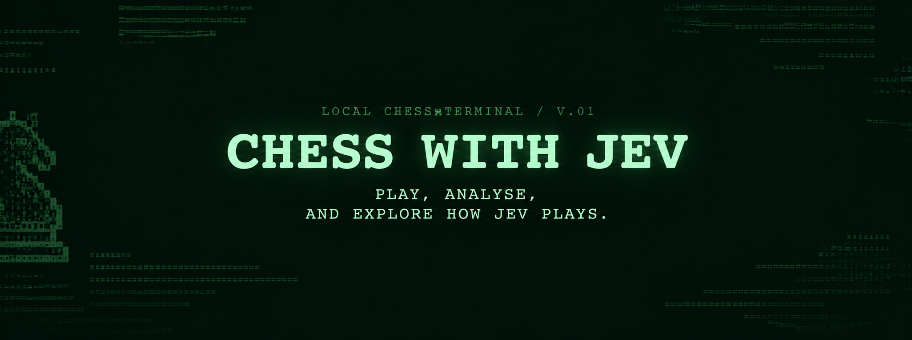

# ChessWithJev



A desktop chess application built with NiceGUI to review how good `Jev` from [typesafe.ai](https://typesafe.ai) is at decision making for Chess. Play against `Jev` as human, Stockfish, random moves, or even `Jev`; compare Stockfish analysis; and export completed games as PGN.

Feel free to clone or fork to add support. This is just a hobby project, so don't rely on fast response to any issues. Fast fixes == Fork and do it yourself!

## Requirements

- Python 3.12 or newer
- [Stockfish](https://stockfishchess.org/download/) on your `PATH` or at `/usr/games/stockfish` on Linux
- Homebrew on macOS if the setup script needs to install Stockfish
- On Linux: Debian/Ubuntu with `apt`, sudo access, and a graphical desktop session

**Note:** while Linux maybe supported, I have not yet tested it.

## Install

Clone the repository, then run:

```bash
bash scripts/setup.sh
```

The script creates a local `.venv` and installs the Python dependencies. On macOS, it installs Stockfish with Homebrew when necessary. On Linux, it uses apt to install Stockfish, venv support, and Qt system libraries, then installs the Qt webview backend in `.venv`. Use a Python 3.12+ installation as `python3`; run setup as your regular user (sudo is used for apt only).

## Configure Jev

Jev is optional (if this is not your goal, although why?). It is used only when you select `jev` as a player in the application.

1. Create an API key in your TypeSafe account.
2. Set it in the shell where you will launch the application:

   ```bash
   export JEV_API_KEY="your-api-key"
   ```

   OR

   Create a `.env` file with similar to `.env.example` and add your Jev API key in it. Then run the following:

   ```
   set -a
   source .env
   set +a
   ```

3. Start the app from that same shell.

    ```bash
    .venv/bin/chess
    ```

Choose a player for White and Black from the application menu. When Jev is selected, the Jev Predictions tab shows its chosen move and highest-rated legal alternatives.

## Game files

- `gamelog/latest.json` contains the most recently completed game.
- **Save** writes dated JSON and PGN copies under `gamelog/rec/`.
- **Export PGN** writes the current game under `gamelog/pgn/`.

## Development

Run the test suite with:

```bash
.venv/bin/python -m pytest -q
```

## Jev implemenation idea

The idea was simple to use the `choice` of `jev` to rate all available legal moves and choose the best one.

i.e 
```
Chess position (FEN) → Generate legal moves → Jev Choice → Rank moves → Play highest-rated move
```

This works because of a well-known chess composition by Nenad Petrović demonstrated a position with `218` legal moves that can actually be reached through a legal sequence of moves from the standard game start. 
As of 04.10.2026, latest `jev` can handle up to 256 choices.

## Upcoming features

- I want to add support for local models from Ollama like `nimble` and `clef`. Although this will need a new architecture as the model doesn't support > 26 legal moves.
